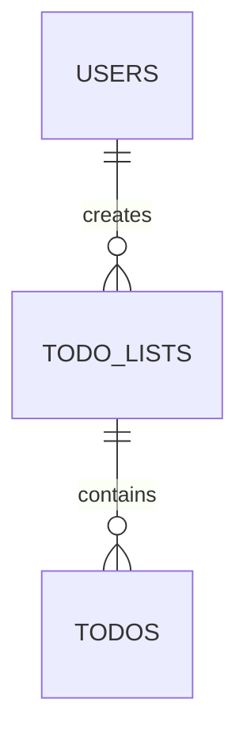

These are the tables used in the application and how they interact with each other.

## Tables

### users
Stores user authentication and account information.

| Column        | Type         | Description                     |
|---------------|--------------|---------------------------------|
| id            | SERIAL       | Primary key                     |
| username      | VARCHAR(50)  | Unique identifier for the user  |
| password_hash | VARCHAR(100) | Securely stored password hash   |
| created_at    | TIMESTAMP    | Account creation timestamp      |

### todo_lists
Contains the todo lists created by users.

| Column      | Type         | Description                     |
|-------------|--------------|---------------------------------|
| id          | SERIAL       | Primary key                     |
| username    | VARCHAR(50)  | Foreign key to users.username   |
| title       | VARCHAR(100) | List title                      |
| description | TEXT         | Optional list description       |
| created_at  | TIMESTAMP    | Creation timestamp              |
| updated_at  | TIMESTAMP    | Last update timestamp           |

### todos
Individual todo items within lists.

| Column      | Type         | Description                     |
|-------------|--------------|---------------------------------|
| id          | SERIAL       | Primary key                     |
| list_id     | INTEGER      | Foreign key to todo_lists.id    |
| title       | VARCHAR(100) | Todo item title                 |
| description | TEXT         | Optional item description       |
| completed   | BOOLEAN      | Completion status               |
| created_at  | TIMESTAMP    | Creation timestamp              |
| updated_at  | TIMESTAMP    | Last update timestamp           |

## Relationships

- Each user can have multiple todo lists
- Each todo list belongs to one user
- Each todo list can have multiple todos
- Each todo belongs to one list
- Deleting a user cascades to delete their lists and todos
- Deleting a list cascades to delete its todos

## Indexes
The following indexes are maintained for query optimization:

- `todo_lists_username_idx`: Optimizes queries filtering by username in todo_lists
- `todos_list_id_idx`: Optimizes queries filtering by list_id in todos
